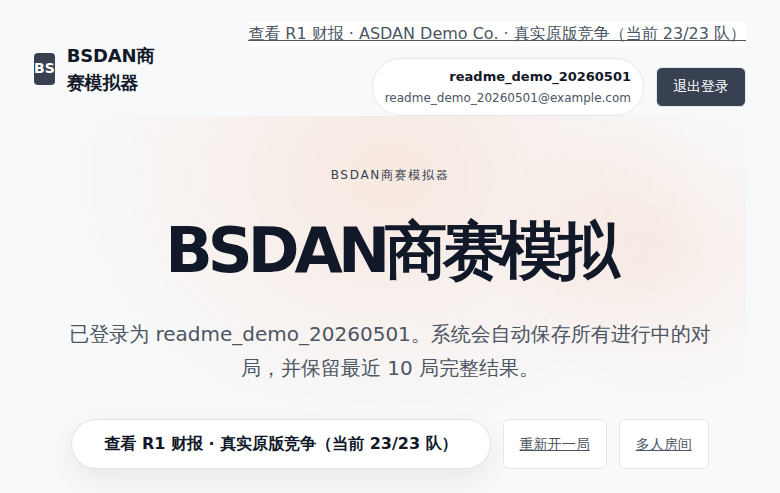
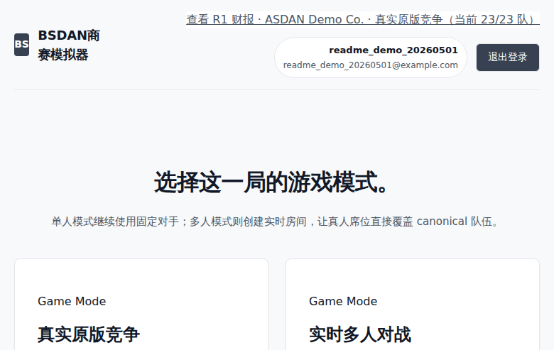
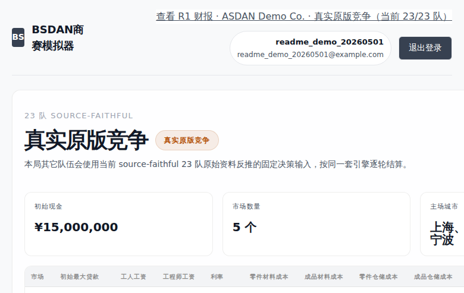
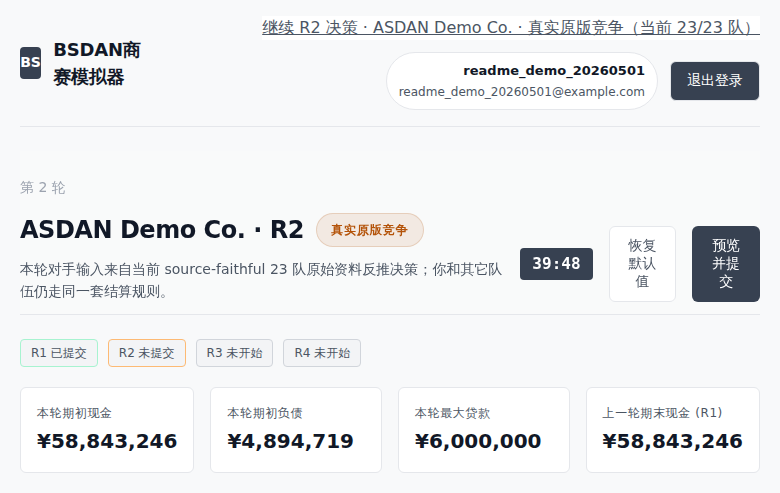
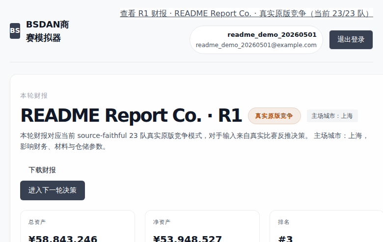
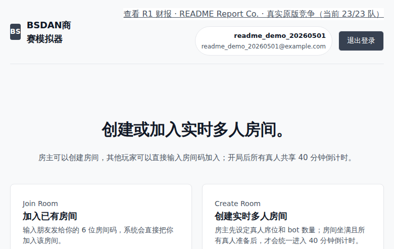

# BSDAN Business Simulator

[Live demo](https://bsdan.ye97.cn) | [中文说明](docs/README.zh-CN.md) | [Architecture](docs/ARCHITECTURE.md) | [Testing](docs/TESTING.md)

BSDAN Business Simulator is a web-based business competition simulator for training, replay, and classroom multiplayer use. It turns historical ASDAN/Exschool-style competition spreadsheets, inferred competitor decisions, market-share modeling, inventory constraints, financial settlement, and round reports into a browser-playable four-round management game.

This is not an official ASDAN/Exschool engine and it is not an ERP system. The project is best understood as an educational simulation platform: users make operating decisions, compete against fixed historical opponents or live room participants, and receive explainable financial and market reports after each round.



## Highlights

- Four-round business simulation with loans, repayments, hiring, wages, production, sales agents, marketing, pricing, management, quality, R&D, and market report purchases.
- Real-original single-player mode where the player competes against 23 historical/inferred opponent teams.
- High-intensity practice mode with stronger fixed opponents for strategy stress testing.
- Live multiplayer rooms with host setup, canonical team seats, bot fill, ready states, round submission tracking, and shared settlement.
- Data-driven market-share modeling trained from the bundled historical workbooks and constrained by inventory, capacity, market size, home-city effects, pricing, agents, and demand gaps.
- Full financial loop for revenue, cash, debt, net assets, tax, materials, storage, wages, patents, and cross-round inventory.
- Browser reports plus image-style report export through Playwright.
- Regression tests for engine fidelity, finance, inventory, market allocation, campaign state, multiplayer state, report payloads, data provenance, and modeling behavior.

## Screenshots

| Mode selection | Single-player setup |
| --- | --- |
|  |  |

| Round decision | Round report |
| --- | --- |
|  |  |

| Multiplayer setup |
| --- |
|  |

## What Users Can Do

1. Register or log in with an email verification code when SMTP is configured.
2. Start a single-player game in real-original or high-intensity mode.
3. Create a multiplayer room, choose the number of human seats and bot seats, and invite other players.
4. Submit round-by-round decisions for production, people, finance, market investment, and strategy.
5. Review market share, sales, inventory, cash, debt, net assets, ranking, and round notes.
6. Export image-style reports for review or classroom discussion.

## Repository Contents

```text
exschool_game/                         FastAPI app, templates, static assets, simulator modules
exschool/                              Required bundled Exschool market and Team 13 workbooks
outputs/exschool_inferred_decisions/   Required inferred opponent decision workbooks
outputs/exschool_market_report_exports/Structured market-report exports used by the loader/tests
WYEF_results/                          Required compact model-validation/runtime workbooks
generated_reports/model_pipeline_current_baseline/
                                       Baseline metrics used by launch preflight
scripts/                               Startup, preflight, and browser validation scripts
deploy/                                Example systemd/nginx/env deployment files
docs/                                  English and Chinese documentation
test_*.py                              Regression tests
```

The bundled `.xlsx` files are intentional. They are not user secrets; they are the data artifacts needed for the public project to run the historical-opponent and model-backed modes. Runtime state, sessions, local credentials, Playwright output, and caches are ignored.

## Quick Start

Python 3.11+ is recommended.

```bash
python3 -m venv .venv
. .venv/bin/activate
pip install -r requirements.txt
uvicorn exschool_game.app:app --reload --app-dir . --port 8010
```

Open:

```text
http://127.0.0.1:8010
```

You can also run:

```bash
python -m exschool_game.app
```

## Development Setup

Install test and browser tooling:

```bash
pip install -r requirements-dev.txt
python -m playwright install chromium
```

Optional OCR/reconstruction tooling:

```bash
pip install -r requirements-ocr.txt
```

The OCR scripts also need system-level tools and cloud credentials when you run extraction workflows. The web simulator itself does not require OCR credentials.

## Docker Compose

For a clean local smoke test:

```bash
cp deploy/exschool-game.env.example .env.local
docker compose up --build
```

Then open:

```text
http://127.0.0.1:8010
```

Do not put production secrets in committed files. Use a local `.env.local`, server-side environment files, or your deployment platform's secret manager.

## Configuration

Useful environment variables:

| Variable | Purpose |
| --- | --- |
| `EXSCHOOL_SESSION_SECRET` | Session signing secret. Required for stable production sessions. |
| `EXSCHOOL_SESSION_HTTPS_ONLY` | Set to `true` when serving only over HTTPS. |
| `EXSCHOOL_ROOT_PATH` | Optional ASGI root path for reverse-proxy subpaths. |
| `EXSCHOOL_AUTH_SITE_NAME` | Site name shown in email verification messages. |
| `SMTP_HOST`, `SMTP_PORT`, `SMTP_USER`, `SMTP_PASSWORD` | SMTP settings for email verification. |
| `SMTP_FROM_EMAIL`, `SMTP_FROM_NAME` | Sender identity for verification emails. |
| `EMAIL_CODE_EXPIRE_SECONDS`, `EMAIL_CODE_RESEND_SECONDS` | Verification-code timing controls. |

Without SMTP, the simulator can still be developed locally, but self-service email login/register flows will not send real verification messages.

## Testing

Run the core regression suite:

```bash
python -m pytest -q
```

Run launch preflight:

```bash
python scripts/launch_preflight.py
```

Run browser checks when Playwright is installed:

```bash
python scripts/validate_exschool_modes_playwright.py
python scripts/validate_multiplayer_room_playwright.py --human-seats 2 --bot-count 1 --rounds 1
```

See [docs/TESTING.md](docs/TESTING.md) for the validation matrix.

## Production Deployment

The app is a normal FastAPI service behind a reverse proxy. A typical deployment uses:

- `scripts/start_exschool_game.sh` as the service entry point
- `deploy/exschool-game.service` as a systemd template
- `deploy/nginx-exschool-game.conf` as an nginx reverse-proxy template
- a server-local environment file such as `/etc/exschool-game.env`
- a writable `storage/` directory for sessions, saved games, room state, and report image cache

For production, set a strong `EXSCHOOL_SESSION_SECRET`, configure SMTP if public registration is enabled, serve over HTTPS, and keep `storage/` out of Git.

## Architecture

The high-level flow is:

```text
FastAPI routes and Jinja templates
  -> auth, saved games, single-player flow, multiplayer rooms
  -> campaign_support.py normalizes form payloads and cross-round state
  -> engine.py orchestrates one round of simulation
     -> modeling.py predicts CPI/share signals from bundled historical data
     -> workforce.py settles hiring, salaries, capacity, and attrition
     -> inventory.py settles parts, products, production caps, and storage
     -> market_allocation.py allocates constrained stock across markets
     -> finance.py builds financing and cash-flow helpers
     -> research.py settles patents and material-cost effects
  -> report_payload.py builds KPI, finance, HR, production, sales, and peer tables
  -> export_report_html.py renders downloadable report HTML/images
```

More detail is in [docs/ARCHITECTURE.md](docs/ARCHITECTURE.md).

## Model and Data Notes

The simulator is a training/replay model, not a claim to reproduce any official hidden scoring engine.

- The model is trained from bundled historical competition workbooks, market reports, structured report exports, inferred opponent decisions, and Team 13 reference data.
- CPI and market-share logic combine learned signals with explicit constraints for home city, price, market slack, inventory, market capacity, and demand allocation.
- Final sales are not raw model output. They are constrained through stock, capacity, market size, sales agents, and gap-absorption rules.
- Historical data is limited and some opponent inputs are inferred, so the project is most appropriate for practice, replay, classroom simulation, and portfolio demonstration.

## Project Status

This is a working vertical web application rather than a landing-page demo. It includes a FastAPI web app, single-player and multiplayer flows, historical opponents, model training, rule settlement, report rendering, persistent storage, deployment templates, and tests.

It is still early as a production product. The highest-value next steps are a public release process, hosted demo hardening, more route/service decomposition, stronger persistent storage for larger deployments, and published benchmark reports for fixed validation scenarios.

## License and Data

No license is declared yet. Treat the code and bundled educational data as all-rights-reserved until a license is added.
